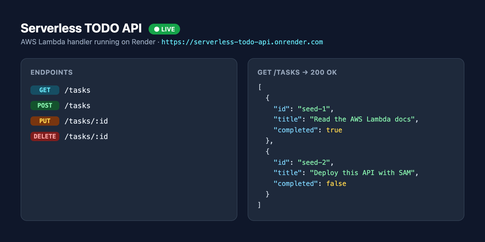

# Serverless TODO Backend — AWS Lambda + API Gateway

A serverless REST API for managing TODO tasks, demonstrating an AWS Lambda
architecture. A single Lambda function sits behind **API Gateway** and persists
data in **DynamoDB**. Infrastructure is defined as code with an **AWS SAM**
template.

> **Project 2 of 3** for the *Cloud Computing with AWS* internship. No frontend.

---

## Live Demo

**🔗 https://serverless-todo-api.onrender.com/tasks** — the Lambda handler running
live on Render (see [Alternative: Live Demo Deployment on Render](#alternative-live-demo-deployment-on-render-no-aws-account-needed)).



---

## Architecture

```
   Client (curl / Postman / any frontend)
        │  HTTPS
        ▼
   Amazon API Gateway        ← routing, throttling, HTTPS endpoint
        │  Lambda proxy integration
        ▼
   AWS Lambda (Node.js 20)   ← one function handles all /tasks routes
        │  AWS SDK v3
        ▼
   Amazon DynamoDB           ← "TodoTasks" table (on-demand billing)
```

The same Lambda function handles every route (proxy integration). For local
development the function falls back to an **in-memory store** when no
`TABLE_NAME` environment variable is present, so you can run and test it with
zero AWS setup.

---

## REST API

Base URL after deploy: `https://<api-id>.execute-api.<region>.amazonaws.com/Prod`

| Method | Endpoint | Description | Body |
|--------|----------|-------------|------|
| `GET` | `/tasks` | List all tasks | — |
| `POST` | `/tasks` | Create a task | `{ "title": "string", "completed": false }` |
| `PUT` | `/tasks/{id}` | Update a task | `{ "title"?: "string", "completed"?: true }` |
| `DELETE` | `/tasks/{id}` | Delete a task | — |

**Task shape**
```json
{
  "id": "uuid",
  "title": "Deploy with SAM",
  "completed": false,
  "createdAt": "2026-07-17T12:00:00.000Z"
}
```

Responses: `200` OK, `201` Created, `400` validation error, `404` not found,
`405` method not allowed, `500` server error. CORS headers are included on every
response.

---

## Folder Structure

```
project-2-serverless-todo/
├── src/
│   ├── handler.js       # Lambda entry point — routes all /tasks requests
│   ├── repository.js    # Data layer: DynamoDB if TABLE_NAME set, else in-memory
│   ├── response.js      # API Gateway response helper (JSON + CORS)
│   └── local.js         # Local HTTP harness to test the handler without SAM
├── events/              # Sample API Gateway events for `sam local invoke`
│   ├── get-tasks.json
│   ├── post-task.json
│   ├── put-task.json
│   └── delete-task.json
├── template.yaml        # AWS SAM template (API Gateway + Lambda + DynamoDB)
├── package.json
└── README.md
```

---

## Local Development & Testing

You do **not** need AWS credentials, DynamoDB, or Docker to try the API locally.

### Option A — plain Node HTTP harness (fastest)
```bash
npm run local          # starts http://localhost:4000 (in-memory data)
```
Then in another terminal:
```bash
curl http://localhost:4000/tasks
curl -X POST http://localhost:4000/tasks -H "Content-Type: application/json" \
  -d '{"title":"Write the SAM template","completed":false}'
curl -X PUT http://localhost:4000/tasks/seed-2 -H "Content-Type: application/json" \
  -d '{"completed":true}'
curl -X DELETE http://localhost:4000/tasks/seed-1
```
> On macOS, port `5000` is reserved by AirPlay, so this harness uses `4000`.

### Option B — SAM CLI (mirrors the real Lambda runtime, needs Docker)
```bash
sam build
sam local invoke TodoFunction --event events/get-tasks.json
sam local start-api          # serves the API on http://localhost:3000
```

---

## Deploying to AWS

### Prerequisites
- [AWS CLI](https://aws.amazon.com/cli/) configured (`aws configure`)
- [AWS SAM CLI](https://docs.aws.amazon.com/serverless-application-model/latest/developerguide/install-sam-cli.html)
- Docker (used by `sam build`)

### Deploy
```bash
sam build
sam deploy --guided
```
`--guided` walks you through stack name, region, and permissions, then saves
your answers to `samconfig.toml` for future one-command deploys (`sam deploy`).

After deploy, SAM prints the **ApiBaseUrl** output — the live endpoint:
```bash
curl https://<api-id>.execute-api.<region>.amazonaws.com/Prod/tasks
```

### Tear down
```bash
sam delete
```

---

## Alternative: Live Demo Deployment on Render (no AWS account needed)

The same Lambda handler (`src/handler.js`) can run on any Node host via the HTTP
wrapper in `src/local.js`. This repo includes a `render.yaml` blueprint that
deploys it to [Render](https://render.com) as an always-on web service — handy
for a live demo when you don't have an AWS account.

1. In the Render dashboard: **New +** → **Blueprint** → select this repo.
2. Render reads `render.yaml` and provisions the `serverless-todo-api` service.
3. Once **Live**, call it:
   ```bash
   curl https://<your-service>.onrender.com/tasks
   ```

> **Tradeoff:** Render runs this as a persistent service (so the in-memory store
> works reliably), rather than as true per-request serverless functions. The
> AWS-native, fully-serverless deployment (API Gateway + Lambda + DynamoDB) is
> the one described above and defined in `template.yaml`.

---

## IAM Role & Permissions

Following the **principle of least privilege**, the Lambda function is granted
only the DynamoDB permissions it needs on the single `TodoTasks` table — nothing
more.

### How it's configured
In `template.yaml`, the function uses the SAM policy template
`DynamoDBCrudPolicy`:

```yaml
Policies:
  - DynamoDBCrudPolicy:
      TableName: !Ref TasksTable
```

At deploy time SAM automatically creates an **IAM execution role** for the Lambda
and attaches:

1. **`AWSLambdaBasicExecutionRole`** (managed) — lets the function write logs to
   **Amazon CloudWatch Logs**.
2. A scoped inline policy allowing these actions **only on `TodoTasks`** and its
   indexes:

```json
{
  "Effect": "Allow",
  "Action": [
    "dynamodb:GetItem",
    "dynamodb:PutItem",
    "dynamodb:UpdateItem",
    "dynamodb:DeleteItem",
    "dynamodb:Query",
    "dynamodb:Scan",
    "dynamodb:BatchGetItem",
    "dynamodb:BatchWriteItem"
  ],
  "Resource": [
    "arn:aws:dynamodb:<region>:<account-id>:table/TodoTasks",
    "arn:aws:dynamodb:<region>:<account-id>:table/TodoTasks/index/*"
  ]
}
```

The function has **no** access to any other DynamoDB table, S3, or other AWS
service. API Gateway is granted permission to invoke the function via a
`lambda:InvokeFunction` permission that SAM also generates automatically.

---

## AWS Services Used

| Service | Role in this project |
|---------|----------------------|
| **AWS Lambda** | Runs the request-handling code without managing servers |
| **Amazon API Gateway** | Public HTTPS endpoint, routing, request throttling |
| **Amazon DynamoDB** | NoSQL storage for tasks (on-demand billing) |
| **AWS IAM** | Least-privilege execution role for the function |
| **Amazon CloudWatch** | Function logs and metrics |
| **AWS SAM / CloudFormation** | Infrastructure as code + deployment |

---

## Pushing to GitHub

```bash
cd project-2-serverless-todo
git init
git add .
git commit -m "Initial commit: Serverless TODO backend (Lambda + API Gateway + SAM)"
git branch -M main
git remote add origin https://github.com/<your-username>/serverless-todo-lambda.git
git push -u origin main
```

---

## Notes on the mock vs. DynamoDB data layer

`src/repository.js` chooses its backend at startup:

- **`TABLE_NAME` set** (the deployed Lambda) → **DynamoDB**. The AWS SDK v3 is
  pre-installed in the Lambda runtime, so it is imported lazily.
- **`TABLE_NAME` unset** (local dev) → **in-memory array** seeded with two tasks.

This keeps local testing instant while the production path is a real, persistent
serverless database. (An in-memory store would not survive Lambda cold starts,
which is precisely why DynamoDB is used in AWS.)
